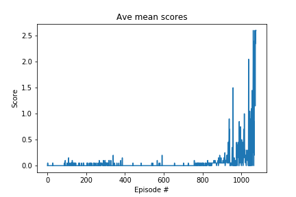

## Project Synopsis

The goal here is to create two agents capable of playing table tennis with each other. When the agent hits the ball over the net, it receives a reward of +0.1. If the ball hits the ground or goes out of bounds, the agent receives a reward of -0.01. Thus the goal of each agent is to keep the ball in play.

The state space has 8 dimensions (corresponding to the position and velocity of the ball and racket). Given this information, each agent has to learn how to best select actions. The action space has 2 dimensions; each entry corresponds to movement toward or away from the net, and jumping.

The task is episodic, and in order to solve the environment, the agent must get an average score of +0.5 over 100 consecutive episodes (after taking the maximum over both agents).

## Implementation 

This work implements the DDPG algorithm (Deep Deterministic Policy Gradients) to the 2 agents Tennis environment, as described in [_Continuous Control with Deep Reinforcement Learning_][ddpg-paper] (Lillicrap et al). The foundation of this code-base is from the [Udacity DRL `ddpg-bipedal` notebook][ddpg-repo]

[ddpg-paper]: https://arxiv.org/pdf/1509.02971.pdf
[ddpg-repo]: https://github.com/udacity/deep-reinforcement-learning/blob/master/ddpg-bipedal/DDPG.ipynb

The network comprises of 2 networks:

- Actor: 256 -> 256
- Critic: 256 -> 256 
- I followed the advice of adding batch-normalization to the output of the first hidden layer which greatly improved the result

Hyperparameters:

- replay buffer size = 1e6
- minibatch size = 1024
- discount factor = 0.99
- tau for soft update of target parameters = 1e-3
- learning rate of the actor = 2e-4
- learning rate of the critic = 2e-4
- L2 weight decay = 0.0

My take-aways from the project are:
1.	Use the class Agent object for the models and instance objects for experience and learning to both speed up learning and assist with convergence
2.	The network is sensitive to batch_size for learning and this varies throughout the process.  Early on a small batch_size is needed to set a baseline for weight to start learning and then as the model grows batch_sizes need to increase to allow the model to continue to learn.
3.	Adding of noise to actions need to be turned off towards the end of learning allowing the model operate purely on a experiential level.

## Results 

The agents were able to solve task solved in 211 episodes!	Average Score: 30.11.

## Enhancements

- Improving results tunning the networks scructures (adding layers or units per layers, ...) 
- In the future it might be worth it to try prioritized experience replay,
- Try using a convolutional network to learn directly from screen capture of playing
- Implement PPO, D3PG or D4PG that probably  would produce better results

